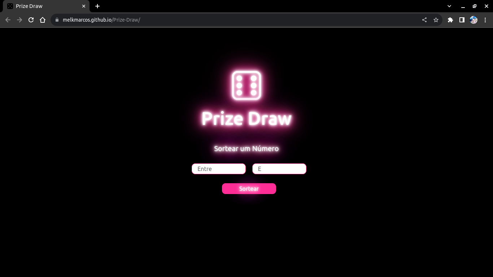

# Projeto "Prize Draw"

Descrição do Projeto: 

## Funcionalidades

- Interface Amigável
- Entrada de Dados Personalizada
- Validação dos Dados
- Realização do Sorteio
- Recomeçar o Sorteio
- Design Responsivo
- Estilo Personalizado

## Objetivos

- Proporcionar uma forma simples e prática para realizar sorteios personalizados de números dentro de um intervalo definido.
- Oferecer uma experiência agradável ao usuário, tornando o processo de sorteio fácil de entender e utilizar.
- Fomentar a interatividade e diversão dos usuários ao promover sorteios de maneira aleatória.

